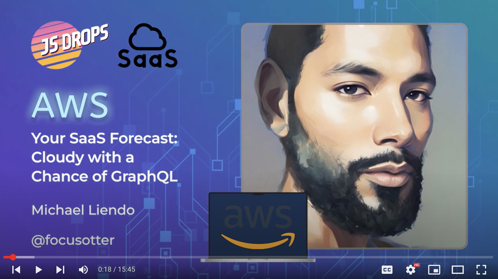

# AWS MicroSaaS Backend

Creates a MicroSaaS backend that is ready to be deployed and used alongside a frontend applicaiton.

For a quick walkthrough of this architecture and why this repo was created, checkout my 15 minute lightning talk where I cover that, as well as give a demo:

## Useful commands

> Checkout the `package.json` file for additional scripts and commands

- `npm run build` compile typescript to js
- `npm run watch` watch for changes and compile
- `npm run test` perform the jest unit tests
- `cdk deploy` deploy this stack to your default AWS account/region
- `cdk diff` compare deployed stack with current state
- `cdk synth` emits the synthesized CloudFormation template
